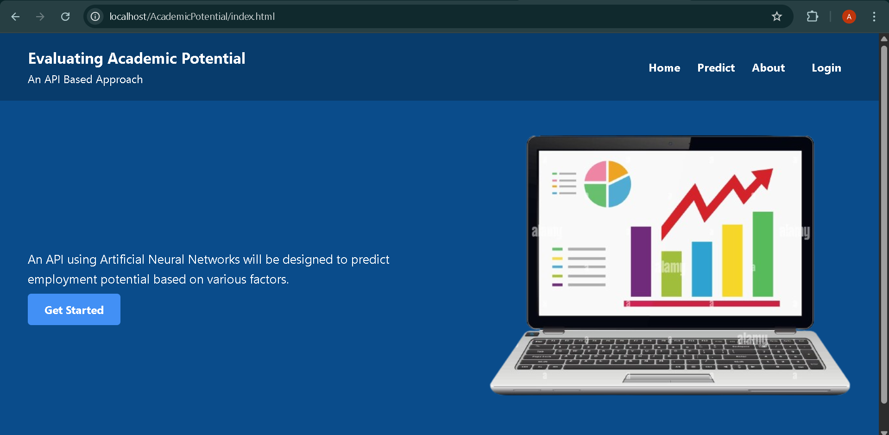

# 🎓 Evaluating Academic Potential: An API-Based Approach

🚀 A web-based system designed to assess the employment potential of academic courses using a simulated API architecture and a clean user-friendly interface.

---

## 📌 Project Description

Choosing the right academic course is critical to a student’s future career. This project aims to evaluate the **employment potential** of a course based on various factors like industry demand, salary, placement rate, etc.

Using an **API-based approach**, this system collects input through a form, processes it using backend logic in PHP, and returns a prediction score. It also stores all prediction data in a MySQL database and includes an admin dashboard for viewing entries.

---

## 🧰 Tech Stack

| Layer       | Technology Used      |
|-------------|-----------------------|
| 🎨 Frontend | HTML, CSS, JavaScript |
| 🧠 Backend  | PHP (API-based logic) |
| 🗄️ Database | MySQL (via XAMPP)     |

---

## 🌐 Webpages Overview

1. **🏠 Home Page**  
   - Intro to the project  
   - "Login" button for Admin access  

2. **ℹ️ About Page**  
   - Problem description  
   - API-based approach explanation  
   - Technology stack  

3. **📊 Prediction Page**  
   - Collects 5 course-specific inputs  
   - Sends data via API to backend  
   - Displays result dynamically  

4. **📈 Result Page**  
   - Shows predicted employment potential score (0–100%)  
   - Designed with smooth UI  

5. **🔐 Admin Dashboard**  
   - Accessible only after admin login  
   - Displays stored prediction data from the database  

---

## 🧠 Prediction Logic (Simulated)

The backend (`get_predictions.php`) receives form data via a `POST` request and simulates a prediction score. In a real-world extension, this would be replaced with a **Multilayer Perceptron (MLP)** or any machine learning model.

---

## 🧪 API-Based Approach

📡 **Frontend → Backend Communication**  
- JavaScript sends data using `fetch()`  
- Backend processes it and returns JSON  
- Result is parsed and displayed without page reload

---

## 🔐 Admin Login System

- Admin credentials checked in `verify_admin.php`  
- If correct, session is created  
- Unauthorized access is restricted  
- Admin can view stored predictions on a protected page

---

## 🗃️ MySQL Database Structure

📂 Database: `AcademicPotential`  
📄 Table: `predictions`

| Field               | Type       |
|---------------------|------------|
| ID (Primary Key)    | INT        |
| All form inputs     | VARCHAR/TEXT |
| Prediction Score    | INT        |
| Timestamp           | TIMESTAMP  |

> All predictions are stored securely and can be reviewed in the admin dashboard.

---

## 📱 UI & UX Features

- 🌐 Fully responsive design for mobile & desktop  
- ✅ Input validation and error handling  
- 🔍 Enlarged form fields for better accessibility  
- 💾 Clean and organized file structure  

---

## 🛠️ How to Run This Project (XAMPP Setup)

1. ✅ Install [XAMPP](https://www.apachefriends.org/index.html)  
2. 📁 Place the folder inside `htdocs` (usually in `C:/xampp/htdocs`)  
3. ▶️ Start Apache and MySQL from the XAMPP control panel  
4. 🌐 Visit `http://localhost/AcademicPotentialK23DJ` in your browser  
5. 🧠 Import the SQL file into `phpMyAdmin` to create the database  

---

## 🚀 Future Scope

- Integrate a real **Neural Network (MLP)** model  
- Enable users to **download PDF reports**  
- Add **graphical insights** on admin panel  
- Implement **email notifications** or a chatbot  

---

## 🙋‍♂️ Made By

**Anoop Grover**  
Student, B.Tech Computer Science & Engineering, Lovely Professional University, Punjab  
💡 Passionate about Web Development and Machine Learning

---

## 📷 Preview (Optional)

> Add screenshots of each webpage here using markdown:

```markdown



